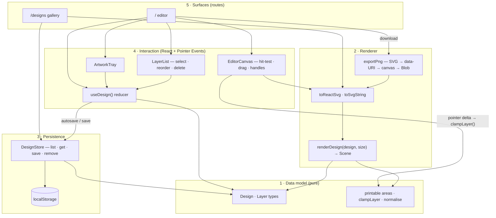

# Cognition Merch Designer — Project Plan (v5.3)

Scope re-set with Rush on 2026-08-24: this is **not a store**. It is a **design tool** — a user picks a blank garment, drags Cognition artwork onto it, arranges it, saves the design, and downloads an image. No browsing a catalog, no cart, no checkout, no prices.

Constant from earlier rounds: demo application · built from scratch · brand assets from the Cognition press kit · repo `bootcamp-team4/devin-swag`.

Team: **Rush** product lead · **Gina** technical lead · **Robin** process lead. Planning only — no implementation has started.

> **v4 → v5 change.** v4 planned a storefront (catalog → PDP → cart → mock checkout → confirmation). That whole flow is deleted. What survives from v4: the three base garments in black and white, the three brand marks, the generated-imagery approach, the team/PR/surface model, and the working agreement. What replaces the store: a canvas editor, a saved-designs gallery, and PNG export. §13 lists exactly what carries over.

---

## 1. Target User & Problem

**Primary user — "the maker."** A Cognition employee, community member, or event attendee who wants Cognition merch that is *theirs*: the otter on the back of a hoodie, the Devin logo small on a cap, a wordmark centred on a white tee. Today the only way to get that is to brief a designer or fight with a print vendor's clunky configurator, so it rarely happens.

**Secondary user — "the organiser."** Whoever is preparing a batch of merch for an offsite, a conference, or a launch and needs to try a dozen layouts quickly, show the options to other people, and hand a print-ready-ish image to a vendor.

**Problem statement.** Cognition has excellent brand assets and no way for anyone to put them on a garment without a designer. This project delivers a self-serve design surface: pick a blank, drag on artwork, see it immediately, keep it, and take an image away.

**Explicit non-problem.** This release does not sell, quote, order, or print anything. It produces a *design* and an *image*, and stops there.

## 2. Product Goal & Definition of Done

**Goal:** a fast, on-brand, direct-manipulation designer where a first-time user gets from a blank tee to a downloaded mockup of their own design in under a minute, with no sign-up.

**Definition of done.** All must be true:

1. A user can complete the golden path unaided: open the app → pick garment and colour → **drag a mark onto the garment** → move, scale, and rotate it → **save the design** → see it in "My designs" → **download a PNG**.
2. All three garments (tee, hoodie, cap) render in both colourways, and all three marks (Cognition, Devin, otter) can be placed on any of them.
3. Direct manipulation works: drag to move, handles to resize proportionally and to rotate, layer order controls, delete. Every gesture also has a keyboard equivalent.
4. Artwork cannot be placed outside the printable area — the design stays physically plausible.
5. Saved designs survive a reload and a browser restart; the gallery lists them with a thumbnail, name, and date, and a design can be reopened, renamed, duplicated, and deleted.
6. Downloaded PNG matches what is on screen — same garment, colour, artwork, placement, scale, and rotation — **at 2000×2000 px**, with a flat opaque background, and it renders correctly when opened outside the browser. **"Matches" means visually equivalent, judged by eye, not pixel-identical** (Gina, 2026-08-24): the automated bar is that the export is non-blank and differs between two different designs. Pixel-diff snapshots are deliberately rejected — they would fail on any antialiasing or font change and teach the team to ignore a red build. It is a **mockup of the garment, not a print file** (see §3.1).
7. Usable on a laptop at any reasonable window size, down to a narrow half-screen window (~1024px). **Phone and tablet support is out of scope** (Gina, 2026-08-24) — this is a laptop web app and the demo is on a laptop.
8. Keyboard-only users can complete the golden path; no axe-core critical violations on the editor or the gallery.
9. `npm run lint`, `tsc --noEmit`, and `npm run build` pass clean in CI on every PR.
10. Playwright e2e covering the golden path (including a real download assertion) passes in CI.
11. **Runs locally** — `git clone && npm install && npm run dev` gets a working editor with no environment variables, no accounts, and no network access required at runtime. This is the delivery target; there is no deployment.

**Anti-goals (explicitly not done):** buying, pricing, cart, checkout, print-vendor integration, user accounts, uploading your own artwork, free-text on garments, an asset CMS.

## 3. Scope

### 3.0 The design model

Everything in this app is one JSON object. Getting this right first is what keeps the rest small.

```ts
type Design = {
  id: string;
  name: string;
  garment: "tshirt" | "hoodie" | "cap";
  colour: "black" | "white";
  layers: Layer[];          // z-order = array order
  updatedAt: string;
};

type Layer = {
  markId: "cognition" | "devin" | "otter";
  x: number; y: number;     // fraction of the printable area, not pixels
  scale: number;            // fraction of printable-area width
  rotation: number;         // degrees
};
```

Two consequences the team should agree on explicitly:

1. **Coordinates are normalised, never pixels.** The same design must render identically in a 320px thumbnail, an 800px editor, and a 2000px export. Storing pixels makes all three disagree; storing fractions makes the renderer the only thing that knows about size.
2. **One renderer, three consumers.** The editor, the gallery thumbnail, and the PNG export all call the same `renderDesign(design, size)`. Any divergence between what you see and what you download is a bug in one component, not three. See §4 for why that function returns a scene description rather than markup.

**Garments and printable areas**

The **printable area** is a rectangle per garment, expressed as fractions of the rendered garment box. Every layer's `x`, `y`, and `scale` is relative to *that rectangle*, not to the image — which is why a design survives being switched from a tee to a cap without recomputing anything. It does three jobs: it bounds clamping (DoD 4), it defines where a click-to-place mark lands, and it makes `scale = 1.0` mean "fills the print area" rather than an arbitrary pixel cap.

| Garment | Rect (fractions of garment box) | Confidence | Notes |
|---|---|---|---|
| T-shirt | x 0.30–0.70, y 0.28–0.62 | Medium | Largest canvas; the default. Least certain at the top edge — too high and artwork sits on the collar |
| Hoodie | x 0.30–0.70, y 0.26–0.52 | Low | Deliberately **shorter** than the tee because the pocket seam cuts across the belly. Where that seam sits on our silhouette is unapproved |
| Cap | x 0.34–0.66, y 0.40–0.58 | Low | Much smaller, and the most consequential — a real cap panel is tiny, and a generous rectangle produces designs that look fine on screen and absurd on a hat |

**These numbers need approval by eye, not in code review — and they are not cheaply changeable later.** Because coordinates are normalised, moving a rectangle moves every existing design's artwork with it; there is no migration path, only "all saved designs now look different." The resolution is built into T3: the contact sheet renders each garment×colour blank **with its print rectangle outlined and a mark at maximum scale**, and Gina approves the numbers from that one image before T5 builds on them.

**Marks:** Cognition logo, Devin logo, otter mascot — the same three as v4, now placeable rather than preset.

### Must-have (M)
| ID | Feature | Notes |
|---|---|---|
| M1 | App shell & brand tokens | Header, footer, monochrome tokens, editor/gallery routes |
| M2 | Design data model | The types above, plus validation, defaults, and printable-area geometry per garment |
| M3 | Garment renderer | `renderDesign(design, size)` — garment silhouette in either colourway with layers composited; used by editor, thumbnail, and export |
| M4 | Garment & colour picker | Switch garment and colour without losing the layers already placed |
| M5 | Artwork tray & drag-to-place | The three marks in a tray; drag onto the garment or click to place at centre |
| M6 | Transform: move, scale, rotate | Pointer drag + handles, clamped to the printable area, with keyboard equivalents |
| M7 | Layer controls | Select, reorder, duplicate, delete; a visible list for keyboard and screen-reader users |
| M8 | Save & persistence | Named designs persisted locally behind a storage seam; autosave of the in-progress design |
| M9 | My designs gallery | Thumbnails, open, rename, duplicate, delete, empty state |
| M10 | PNG download | 2000×2000 export, visually equivalent to the editor; sensible filename |
| M11 | Layout & a11y pass | Laptop widths down to ~1024px; keyboard path; focus management; labels. No phone or touch work |
| M12 | CI, tests, local-run docs | Lint/typecheck/build/unit/e2e in CI; README that gets each of the three leads running in two commands from a fresh clone |

### Optional / stretch (O) — only after every M lands
| ID | Feature |
|---|---|
| O1 | Share a design by URL (design encoded in the link, still no backend) |
| O2 | Undo/redo |
| O3 | Back print and sleeve as additional placement areas |
| O4 | More garments (long sleeve, beanie, tote) — additive to the garment table |
| O5 | Snap-to-centre guides and alignment helpers |
| O6 | Recolour a monochrome mark to the garment's contrast colour automatically |
| O7 | Export a print-ready SVG alongside the PNG |
| O8 | A "request this" hand-off that emails the design to whoever orders merch |

### Out of scope
Accounts/auth, database, uploading arbitrary images, free text and fonts, real ordering or pricing, print-vendor APIs, i18n, collaboration.

### 3.1 Scope decisions closed by Rush, 2026-08-24

Four readings of the brief that would each have changed the product. All now settled — treat them as closed, and re-open only with Rush.

| Question | Decision | What it rules out |
|---|---|---|
| Does "drag Cognition images" mean any image, or ours? | **The fixed set of three marks** — Cognition, Devin, otter | No uploads: no file handling, no moderation, no arbitrary aspect ratios, no asset CMS |
| Is the download a garment mockup or a printer-facing file? | **A mockup** — the artwork composited on the garment | No transparent-background artwork export, no print dimensions or bleed, no vendor hand-off (that stays O7) |
| Can users add text, e.g. a name on the back? | **No text** | No font loading, no input sanitisation, no brand risk from arbitrary strings |
| What export size? | **2000×2000 px**, and we do **not** claim print-readiness | See below |

**On export size specifically.** 2000px is chosen to look crisp on any screen and in a deck. It is deliberately not a print resolution: the otter is a 400×400 raster, so a genuinely print-ready export would upscale it 10× and visibly soften. The plan therefore describes the download as a mockup everywhere, and the UI does not use the word "print". Making it print-ready is an asset problem, not a code problem — it needs a vector or ≥2000px otter, after which raising `EXPORT_SIZE` is a one-line change.

## 4. Technical Approach

### 4.0 Layering

Five layers, dependencies pointing downward only. The dividing line is not client/server — there is no server — it is **React-aware vs. not**: layers 1–3 are plain TypeScript, testable in Node, with no DOM beyond the store's single `localStorage` call.



Two properties this buys, and they are the reason for the shape:

1. **Every pixel comes from `renderDesign`.** Editor, thumbnail, and export all reach it. That is the structural guarantee behind DoD 6 — "the download matches the screen" is enforced by the dependency graph, not by discipline.
2. **Layer 4 does no geometry.** A drag produces a delta, hands it to `clampLayer()` in layer 1, and dispatches the result. So the fiddly maths of an editor is tested in Vitest with no DOM, and is not trapped inside a component.

**Stack (chosen, with reasons):**
- **Vite + React + React Router + TypeScript + Tailwind v4** — a pure single-page app. *Changed from Next.js by Gina on 2026-08-24, after local-only persistence and no-deployment were decided.* The reasoning is worth recording because it is the clearest example of the plan following its own constraints: with no server, no data fetching, no SSR, no `next/image` (artwork is inlined base64), no API routes, and no Vercel, every feature Next exists to provide had been designed out. What remained was routing and a dev server. Vite does that with less configuration, a faster dev loop, a smaller bundle, and — the part that actually matters — **no `"use client"` boundaries and no hydration-mismatch class of bug**, one of which had already surfaced in the gallery during architecture review. Nothing but T1 changed: the five-layer architecture and the other eleven tickets were untouched by the swap, which is itself evidence the layering is sound.
- **Two routes, both client-side:** `/` (editor) and `/designs` (gallery), via React Router. The gallery reads the store in an effect and shows a skeleton until it resolves — with no SSR there is nothing to mismatch, but the skeleton stays because `localStorage` reads are still asynchronous with respect to first paint.
- **No database, no backend — local-only, decided by Gina on 2026-08-24.** Designs live in `localStorage` behind a `DesignStore` interface (`list / get / save / remove`). Swapping in a real backend later means one implementation of that interface, not a rewrite — the same "seam" idea as v4's commerce seam, relocated to where the state actually is. Two consequences of local-only that the team should accept knowingly: designs are **per-browser and non-shareable** (clearing site data loses them, which the UI says out loud), and **two open tabs are last-write-wins** — the store listens for the `storage` event and refreshes the gallery rather than pretending to merge.
- **Layers 1–3 contain no React and no DOM.** The types, the geometry, the renderer, and the store are plain TypeScript modules, unit-testable in Node. Only the interaction components and the routes know about events and re-renders. Dependencies point downward only; nothing in `src/lib` imports from `src/components` or `src/routes`.
- **Design state is a reducer, not a bag of setters.** `useDesign()` dispatches `{type: "move" | "scale" | "rotate" | "place" | "reorder" | "delete"}` against an immutable `Design`. This costs nothing now and is the difference between undo/redo (O2) being an afternoon and being a refactor — with mutable state threaded through component callbacks, it is a refactor.
- **SVG for rendering, canvas only for export.** The editor is an inline `<svg>`: garment path plus one `<image>` per layer. This gives crisp scaling, free hit-testing, and real DOM nodes we can make focusable — which is what makes the keyboard and screen-reader story achievable at all.
- **The renderer returns a scene, not markup.** This is the one place where "one renderer, three consumers" nearly breaks. The editor needs *React elements* — per-layer nodes it can attach refs, focus, and pointer handlers to — while the export needs a *string* to rasterise. A renderer that returned an SVG string would force the editor into `dangerouslySetInnerHTML`, which throws away exactly the DOM nodes the accessibility story depends on. So:
  ```ts
  renderDesign(design, size): Scene        // pure: [{garmentPath}, {markId, href, transform}, …]
  toReactSvg(scene): ReactElement          // editor + gallery thumbnail
  toSvgString(scene): string               // export only
  ```
  Both adapters are trivial and share the scene, so the geometry still cannot diverge — but neither surface is contorted to fit the other.
- **Export** serialises the same scene and rasterises it once:
  ```ts
  const svg = toSvgString(renderDesign(design, EXPORT_SIZE));
  const img = await loadImage("data:image/svg+xml;base64," + btoa(svg));
  ctx.drawImage(img, 0, 0);            // canvas at EXPORT_SIZE
  canvas.toBlob(blob => downloadAs(`${design.name}.png`, blob));
  ```
- **Marks must be inlined as data URIs, not `href`s to `/brand/*.png`.** An SVG rasterised through an `Image` will not fetch external references, so a design exported with `href="/brand/mark-otter.png"` silently exports a blank garment. Assets are imported as base64 constants at build time. This is the single most likely way M10 breaks, so it is called out here rather than discovered in the ticket.
- **No canvas/editor library** (no Fabric, Konva, or react-dnd). Pointer Events give us drag, and the transform maths is roughly forty lines. A library would be the largest dependency in the repo and would own the accessibility behaviour we care most about.
- **Testing:** Vitest for the transform/clamping maths and the store; Playwright for the golden path including an actual download assertion; axe-core for the editor and gallery.
- **CI:** GitHub Actions — lint, typecheck, build, unit, e2e on every PR.
- **No hosting. Local-only, decided by Gina on 2026-08-24.** The app is delivered as a repo that runs on a laptop; the demonstration is a screen recording plus a live local walkthrough. This removes the Vercel dependency, the last external blocker, and one whole class of work — and it costs nothing, because with no backend and no shared state there is nothing a hosted URL would demonstrate that `npm run dev` does not. The consequence to accept: **there is no link to send anyone.** Sharing means sharing the repo or the exported PNG.

**Dependencies (technical):** `vite`, `react`, `react-router`, `tailwindcss`, `@playwright/test`, `vitest`, `@axe-core/playwright`. No editor library, no state library. Every dependency pinned to a version published ≥7 days before adoption.

**Dependencies (external, blocking):**
| Dependency | Owner | Needed by | Status |
|---|---|---|---|
| Repo + write access | Gina | T1 | Done — `bootcamp-team4/devin-swag` |
| Otter mascot artwork | Rush | T1 | **Resolved** — `public/brand/mark-otter.png` (400×400 RGB). The white matte is keyed out **once, at asset intake in T1**, not at render time: doing it per-render would drag a canvas pass into the pure renderer and slow every thumbnail. Full-colour, so it is the one mark that does not invert per colourway |
| Persistence decision: local-only vs. shareable | Gina | T8 | **Resolved — local-only.** No backend. Share-by-URL stays optional scope (O1), which the store seam keeps cheap |
| Export resolution and whether print-readiness is claimed | Rush | T9 | **Resolved — 2000×2000, mockup only, print-readiness explicitly not claimed** (Rush, 2026-08-24). The otter's 400px cap is the reason; see §3.1 |
| Scope: uploads, text, and what "download" means | Rush | T5, T9 | **Resolved** — three fixed marks, no text, mockup download (Rush, 2026-08-24). See §3.1 |
| Brand approval on user-generated designs | Rush → Marketing | before external sharing | Open — users can now produce off-brand layouts, which v4 could not |
| Hosting / Vercel account | — | — | **Removed** — local-only, no deployment (Gina, 2026-08-24) |

**Major risks:**
| Risk | Impact | Mitigation |
|---|---|---|
| Editor/thumbnail/export drift apart | The download does not match the screen — DoD 6 fails, and it is the feature users will judge | One `renderDesign()` used by all three, enforced by a test that rasterises a fixture design and compares it to the editor's serialised SVG |
| Export renders blank because marks are external `href`s | Silent, ships easily, embarrassing in the demo | Data-URI inlining is an acceptance criterion of T9, with a test that asserts non-blank pixels in the exported bitmap |
| Drag interaction is the hardest thing here and is on the critical path | Slips everything downstream | T5/T6 is the only L-sized ticket before the gallery, it is front-loaded as an early parallel PR, and the fallback is click-to-place plus numeric position and scale inputs, which satisfies every DoD item except the feel |
| ~~Touch drag conflicts with page scroll on mobile~~ | — | **Removed** — phone support is out of scope (Gina, 2026-08-24). Pointer Events are still used rather than mouse events: same code, and it covers trackpad and stylus for free |
| Printable-area rectangles are wrong and only visible by eye | Every design looks subtly off, and normalised coordinates mean there is no migration — changing the rectangle moves all existing artwork | T3 attaches a contact sheet with each print rectangle outlined and a mark at max scale; Gina approves the numbers from that image before T5 builds on them |
| Otter is a 400×400 raster with a white matte | White box on black garments; soft edges when scaled up | Matte keyed out once in T1 and committed as an alpha PNG; export size capped at what 400px supports; a vector or ≥2000px otter is a prerequisite for any real print run (out of scope) |
| Designs are per-browser and invisible to everyone else | A user "saves" a design, clears site data, and loses it | Accepted consequence of local-only; the gallery says so in plain words, and PNG download is the export path that outlives the browser |
| Users produce off-brand or offensive layouts | Brand risk the storefront version did not have | Fixed asset set (no uploads, no text) is the primary control; brand review before anything is shared externally |
| "Design tool" invites infinite polish — snapping, undo, alignment, filters | Blows the timebox | All of it is optional scope O1–O7; the golden path ships first |
| Scope drifts back toward ordering | Rebuilds the store we just deleted | O8 is a hand-off, not a checkout; anything beyond it needs a new plan |

## 5. Team, Roles & Ownership

| Role | Person | Owns | Accountable for |
|---|---|---|---|
| Product lead | **Rush** | Target user, product goal, scope, final demonstration | Sections 1–3 stay true; the demo script and the live walkthrough |
| Technical lead | **Gina** | Architecture, technical quality, major technical decisions | Section 4; the design model, the renderer, and the storage seam; approving any dependency or architecture change |
| Process/project lead | **Robin** | Tickets, status, dependencies, coordination | Section 9 board is current; blockers surfaced within a day; scope-cut calls made early |
| Implementation | **Rush, Gina, Robin (each driving Devin)** | Their assigned PRs end to end | Getting their PR to green CI and merged |
| Review | **Rush / Robin / Gina** | Every PR has exactly one named reviewer | Reviewing within one working day |

**Everyone implements.** Each lead drives Devin on their own PRs and is the author of record. Devin is the executor, not an owner: it writes the code, but a named human owns the outcome, the review response, and the merge.

Distribution of the ten must-have PRs: Gina 3 (model, renderer, export), Rush 4 (the editor surfaces), Robin 3 (persistence, gallery, quality). No one reviews their own PR.

## 6. Surface Strategy — Devin CLI vs. Desktop vs. Cloud

The split is by the *nature of the work*, not by preference. Rule of thumb: **Cloud when the output is a PR, Desktop when the output is a screenshot or a recording, CLI when a human is in the loop editing.**

### Cloud (Devin sessions in the webapp) — the default for implementation
Every ticket that produces a PR: T1–T12 and any optional work. Sessions are long-running, produce reviewable PRs, survive the owner closing their laptop, and can be parallelized as child sessions.
- **Parallelized here:** PR 2 (design model), PR 3 (renderer), PR 4 (app shell) touch disjoint files and run as three concurrent sessions owned by three different people — the biggest schedule compression available, and it front-loads the renderer that everything else depends on.
- **Also here:** CI failure triage, review-comment fixes, and optional scope.
- **Owner-in-Cloud pattern:** the PR owner opens their own session, prompts Devin with the ticket's acceptance criteria verbatim, and stays responsible for the result.

### Desktop (Devin's VM GUI and browser) — verification and demo artifacts
This project leans on Desktop far harder than v4 did, because the product *is* an interaction. Automated tests cannot tell us whether dragging feels right.
- **Drag, resize, and rotate verified by hand** on every editor PR (PRs 5–7) — this is the primary verification method for T5/T6, not a supplement to it.
- **Drag feel on a trackpad**: does the artwork track the pointer without lag or drift? Only a real browser answers this.
- **Export fidelity check**: download the PNG, open it outside the browser, compare it side by side with the editor. DoD 6 is verified visually here.
- **The final demonstration recording** for Rush — the artifact that goes in the readout.
- Already done here: pulling the brand assets out of the Google Drive press kit.

### CLI (Devin CLI on a lead's own machine) — human-in-the-loop editing
Used where a human wants a sub-minute loop and no PR overhead:
- **Rush tuning the feel**: printable-area bounds, default artwork scale, handle sizes, snap thresholds. These are a dozen small numeric judgements that need `npm run dev` open beside them — exactly the wrong shape for a Cloud round trip.
- Gina spiking the SVG→canvas export path before committing the team to it (does the data-URI approach survive the otter's alpha channel?).
- Anyone reproducing a review comment locally before asking for a fix.
- Output still lands as a normal PR; the CLI is the authoring environment, not a bypass of review.

### Explicitly not used
No deploys at all — hosting is out of scope, and in particular nothing goes to anyone's personal account. The app runs on a laptop; the shareable artifact is the recording from T13.

## 7. Tickets

Estimates are in Devin sessions (S ≈ ¼, M ≈ ½, L ≈ 1). "Owner" is the human accountable; Devin executes on the named surface.

| ID | Title | Owner | Surface | Est | Depends on | Acceptance criteria |
|---|---|---|---|---|---|---|
| T0 | Repo access & branch protection | Gina | — | — | — | Branch protection on `main` requiring one review and green CI. **Done** — no hosting to arrange |
| T1 | Scaffold app, CI, brand assets | Gina | Cloud | M | T0 | Vite + React + React Router + TS + Tailwind builds and serves; lint/typecheck/build/test scripts green in GitHub Actions; press-kit assets under `public/brand`; **otter's white matte keyed out and committed as an alpha PNG**; all three marks also exported as base64 constants for the export path; README |
| T2 | Design data model | Gina | Cloud | M | T1 | `Design`/`Layer` types as in §3.0; per-garment printable-area geometry; clamping and normalisation helpers; unit tests cover clamping at the bounds, rotation wrap-around, and round-tripping a design through JSON |
| T3 | Garment renderer | Gina | Cloud + Desktop | L | T1, T2 | `renderDesign(design, size) → Scene` plus `toReactSvg` / `toSvgString` adapters; all 6 garment×colour blanks render with layers composited at correct position, scale, rotation and z-order; a test asserts the two adapters produce the same geometry from one scene; identical output at 320/800/2000px; alt text describes the design; no external image requests; contact sheet attached to the PR **with each printable rectangle outlined and a mark at max scale, for Gina to approve the geometry by eye — this is the approval gate for the rectangles in §3.0** |
| T4 | App shell, editor & gallery routes | Robin | Cloud | S | T1 | Header, footer, `/` (editor) and `/designs` (gallery) routes wired through React Router with loading states; layout holds down to a ~1024px window; full keyboard navigation; pages may be stubs |
| T5 | Artwork tray & drag-to-place | Rush | Cloud + Desktop | L | T3, T4 | Three marks in a tray; drag onto the garment places a layer where dropped; click/Enter places at centre; works with pointer and keyboard; placement clamped to the printable area |
| T6 | Transform: move, scale, rotate | Rush | Cloud + Desktop | L | T5 | Selected layer shows handles; drag to move, corner handles scale proportionally, rotate handle rotates; state changes go through the `useDesign` reducer, never direct mutation; **clamping uses the rotated bounding box**, so a rotated mark cannot poke outside the printable area; min/max scale enforced; arrow keys nudge, `+`/`-` scale, `[`/`]` rotate; transform maths unit-tested with no DOM |
| T7 | Garment & colour picker | Rush | Cloud | S | T5 | Switching garment or colour keeps existing layers, re-clamping them into the new printable area; state reflected in the URL; caps visibly constrain artwork size |
| T8 | Save, autosave & persistence | Robin | Cloud | M | T2, T6 | `DesignStore` interface with a `localStorage` implementation; explicit save with a name; in-progress design autosaved and restored after reload and browser restart; store unit-tested against an in-memory implementation of the same interface; a second tab's changes refresh rather than clobber silently (`storage` event); versioned payload so a schema change does not crash on old saved designs |
| T9 | PNG download | Gina | Cloud + Desktop | M | T3, T8 | Download produces a PNG matching the editor exactly at 2000×2000 px; marks inlined as data URIs; test asserts the exported bitmap is not blank and differs between two different designs; filename derived from the design name; downloaded file opens correctly outside the browser |
| T10 | My designs gallery | Robin | Cloud | M | T8, T3 | Client-rendered with a skeleton while the store loads — no hydration mismatch; thumbnails from the same renderer; open, rename, duplicate, delete with confirmation; empty state links to the editor; copy states designs are stored in this browser only; sorted by last updated |
| T11 | Layout & a11y pass | Rush | Cloud + Desktop | S | T7, T10 | Editor holds together from a ~1024px window to full screen; layer list gives keyboard and screen-reader users everything the canvas gives pointer users; focus visible and managed on select/delete; axe-core zero critical violations on editor and gallery. **Size reduced from M — phone/touch scope removed** |
| T12 | E2E, CI & local-run docs | Robin | Cloud | M | T11, T9 | Playwright golden path green in CI including a real download assertion; unit tests in CI; **README verified by each of Rush, Gina, and Robin cloning fresh and running two commands once, before demo day** (Gina, 2026-08-24: the bar is our three machines, not an arbitrary reviewer's) — no env vars, no accounts; README also explains the design model and the storage seam |
| T13 | Demonstration script & recording | Rush | Desktop | S | T12 | 3–5 minute recorded walkthrough — blank tee to downloaded PNG — run against a local dev server, plus a written script for the live readout. With no hosted URL, **this recording is the shareable artifact** |
| T14 (opt) | Share-by-URL | Gina | Cloud | M | T12 | Design encoded in the link; opening a shared link loads it into the editor; still no backend |
| T15 (opt) | Undo/redo | Rush | Cloud | M | T12 | Undo/redo across place, transform, reorder, delete; `Cmd/Ctrl+Z` and `Shift+Cmd/Ctrl+Z` |

**Must-have total (T1–T12): ~4.5 sessions of Devin execution**, compressible to ~3 elapsed by running PRs 2–4 in parallel. (Dropping deployment took roughly half a session off T12 and removed the last external blocker.) That is one session more than v4 — the editor is genuinely harder than a catalog, and the honest number is better than a comfortable one. T13 is human-gated; T14–T15 add ~1.

Tickets can be filed in Linear with these acceptance criteria on request — name the team/project and Robin becomes the reporter on all of them.

## 8. Pull-Request Breakdown

Every PR is independently reviewable, leaves `main` runnable, and has one owner and one reviewer. Target size: under ~400 changed lines; anything larger gets split.

| PR | Title | Tickets | Owner | Reviewer | Scope boundary (what it deliberately excludes) |
|---|---|---|---|---|---|
| 1 | `chore: scaffold app and CI` | T1 | Gina | Robin | Config, tokens, assets, CI only — no product code |
| 2 | `feat: design data model` | T2 | Gina | Rush | Types, geometry, and unit tests; zero UI |
| 3 | `feat: garment renderer` | T3 | Gina | Robin | Pure rendering on a dev-only contact-sheet route; not interactive |
| 4 | `feat: app shell and routes` | T4 | Robin | Gina | Chrome and routing only; editor and gallery stay stubs |
| 5 | `feat: artwork tray and drag-to-place` | T5 | Rush | Gina | Placement only; no resize or rotate; nothing persisted |
| 6 | `feat: transform handles` | T6 | Rush | Robin | Move/scale/rotate on the selected layer; no layer list yet |
| 7 | `feat: garment and colour picker` | T7 | Rush | Robin | Picker plus re-clamping; no persistence |
| 8 | `feat: save and autosave` | T8 | Robin | Gina | Store seam and save UX; gallery still a stub |
| 9 | `feat: png download` | T9 | Gina | Rush | Export path only; no share links |
| 10 | `feat: my designs gallery` | T10 | Robin | Rush | Gallery CRUD; no editing inside the gallery |
| 11 | `fix: layout and a11y pass` | T11 | Rush | Gina | Behaviour-preserving; no new features |
| 12 | `test: e2e and local-run docs` | T12 | Robin | Gina | Tests and README only, no behaviour change |
| 13+ | optional scope | T14, T15 | as assigned | as assigned | One PR per optional item |

**Sequencing.** PRs 2, 3, 4 run in parallel after PR 1 merges (disjoint files, three owners). PRs 5→6→7 are sequential on the editor. PR 8 can start once PR 6 merges; PRs 9 and 10 both depend on PR 8 and can run in parallel. PRs 11 and 12 land last against the finished flow.

**Keeping PRs reviewable.** Stubs are the mechanism: each PR introduces the interface the next one fills in (PR 5 ships layers held in component state, PR 8 makes them persistent). That is what lets an editor be built in ten small PRs instead of three large ones.

## 9. Working Agreement — Status, Dependencies, Blockers

- **Board.** Robin maintains one board (Linear or GitHub Projects) with columns `Blocked / Ready / In progress / In review / Done`. A ticket moves to `In progress` when its Devin session starts and to `In review` when its PR opens — status is derived from the PR, never from memory.
- **Dependencies are declared on the ticket** using the `Depends on` column above. Nothing enters `Ready` until its dependencies are `Done`. T0 blocks everything; T2/T3 block all editor work; T8 blocks T9 and T10.
- **Blockers get raised the day they appear**, in the team channel, naming the ticket, who is blocked, and what is needed. Live external blockers: export resolution (Rush) and brand approval before external sharing. Persistence and hosting are both decided; the dependency table is the record.
- **Review SLA:** one working day. A PR waiting longer is a blocker and gets raised as one.
- **Definition of "Done" per ticket:** PR merged, CI green, acceptance criteria demonstrably met (screenshot, recording, or test output linked in the PR). For the editor tickets, a short screen recording of the interaction is the expected evidence.
- **Decisions get written down** in this doc — architecture by Gina, scope by Rush — so the readout matches what was built. v5 exists because that rule was followed.

## 10. Re-Scoping Triggers

The demonstration is the deliverable; anything that threatens it gets cut. Agreed triggers, decided by Rush with Gina:

| Trigger | Action |
|---|---|
| Any PR exceeds ~400 lines or two sessions | Split it; PR 6 splits into move vs. scale/rotate, PR 10 into list vs. CRUD |
| The must-have set is not on track with a third of the time left | Cut in this order: PR 12 e2e → PR 10 gallery down to a plain list → PR 6 rotation → PR 3 rich silhouettes (fall back to flat garment blocks) |
| Drag interaction proves too fiddly to finish | Fall back to click-to-place plus numeric position/scale/rotation inputs; the design model and every other feature are unaffected |
| Export fidelity cannot be made exact | Ship the download with a known, documented difference (e.g. no rotation) rather than dropping the download entirely — it is a core user promise |
| Persistence needs a backend after all | That is a new plan, not a bigger ticket; escalate to Gina before any work starts |
| The otter cannot be made to read well on a black garment | Ship it anyway with a contrast warning in the UI, or restrict it to white blanks |
| Someone asks for a hosted URL late | Declined for this release — it was removed deliberately; a hosted build is a separate decision with its own account and brand-review implications |
| Anyone proposes adding ordering or pricing | Declined — that was v4 and it was deliberately removed |

Cuts come out of *fidelity*, never out of the golden path: place artwork → save → download ships even in the worst case.

## 11. Coaching Asks for the DEs

Queued questions rather than guesses, one per topic:
1. **Technical (Gina):** is hand-rolled SVG + Pointer Events the right call for a drag-and-drop editor, or does avoiding a canvas library cost more in accessibility and edge cases than it saves in dependency weight? (The related question — whether Next.js still earned its place with no server — was asked and answered during planning: it did not, and the stack moved to Vite.)
2. **Task scoping (Robin):** twelve must-have PRs for a team of three — is the editor split (place / transform / picker as three PRs) the right granularity, or does slicing one interaction across three PRs create more review overhead than it saves?
3. **Prompting (all):** the best way to specify an *interaction* to a Cloud session so the PR comes back feeling right, given the session cannot feel the drag itself — and how much of that verification belongs on Desktop instead.
4. **Product usage (all):** how to divide work between parallel child sessions and one long session for PRs 2–4, and how to keep three concurrent sessions from colliding on the same files.

## 12. Immediate Next Steps

| # | Action | Owner | Unblocks |
|---|---|---|---|
| 1 | Approve this v5 pivot, the design model, and the DoD | Rush | Everything |
| 2 | Decide local-only vs. shareable persistence | Rush → Gina | T8, and possibly the whole architecture |
| 3 | ~~Confirm export size and whether we claim print-readiness~~ | Rush | **Done** — 2000px mockup, §3.1 |
| 4 | Branch protection on `main` | Gina | Merges |
| 5 | Re-file tickets against v5 (v4's T5–T10 are void); stand up the board | Robin | Tracking |
| 6 | On approval: PR 1, then PRs 2–4 in parallel | Gina / Rush / Robin | The build |

## 13. What Carried Over From v4

For anyone who reviewed the storefront plan and is diffing it mentally:

| v4 | v5 |
|---|---|
| Three garments in black and white | **Kept** — now blanks to design on rather than SKUs |
| Cognition / Devin / otter marks | **Kept** — now placeable artwork rather than a product axis |
| Generated SVG mockups (no photography exists) | **Kept and promoted** — the renderer is now the core of the product |
| 78-SKU product matrix, prices | **Deleted** — there is nothing to sell |
| Catalog, product detail, cart, mock checkout, confirmation | **Deleted** |
| `createOrder()` commerce seam | **Replaced** by the `DesignStore` seam — same idea, different boundary |
| Team roles, 3-way PR split, surface strategy, working agreement | **Kept** |

### Current state
- Brand assets pulled from the Drive press kit: Cognition and Devin wordmarks and avatars (SVG + PNG, black and white), four sticker artworks (PDF), two Devin interface screenshots. No product photography — the reason the renderer exists. The otter mascot was supplied separately by Robin and is committed at `public/brand/mark-otter.png`.
- No implementation work has been done. An exploratory Next.js scaffold exists on the Devin VM only; it was written against the v4 storefront and is obsolete twice over — wrong product, wrong framework.
